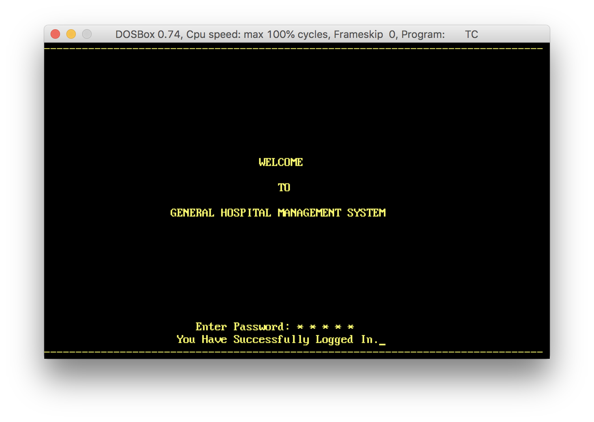
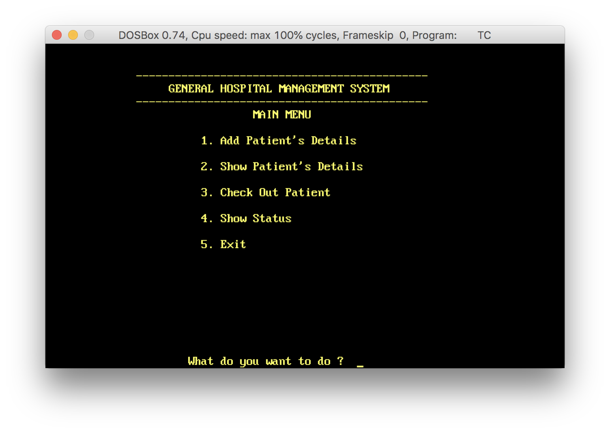
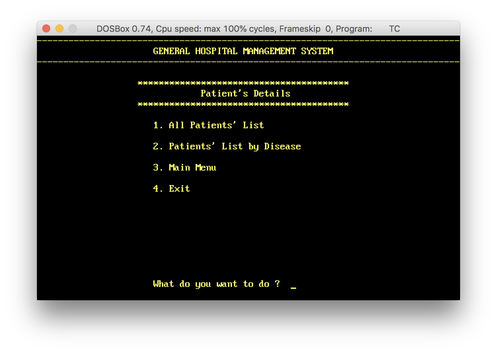
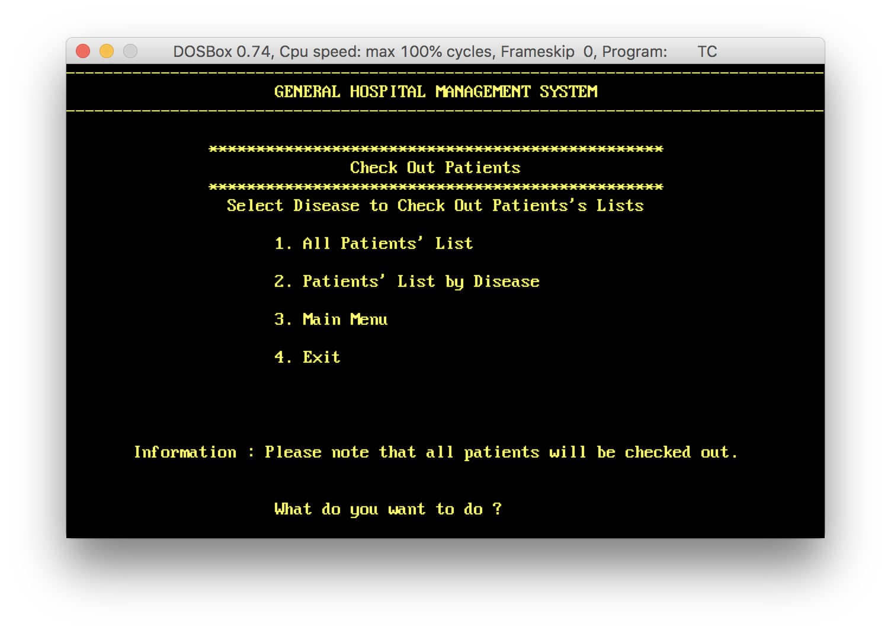
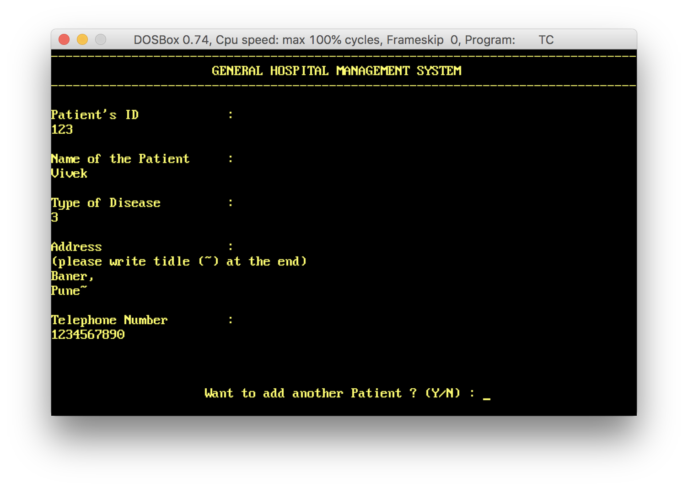
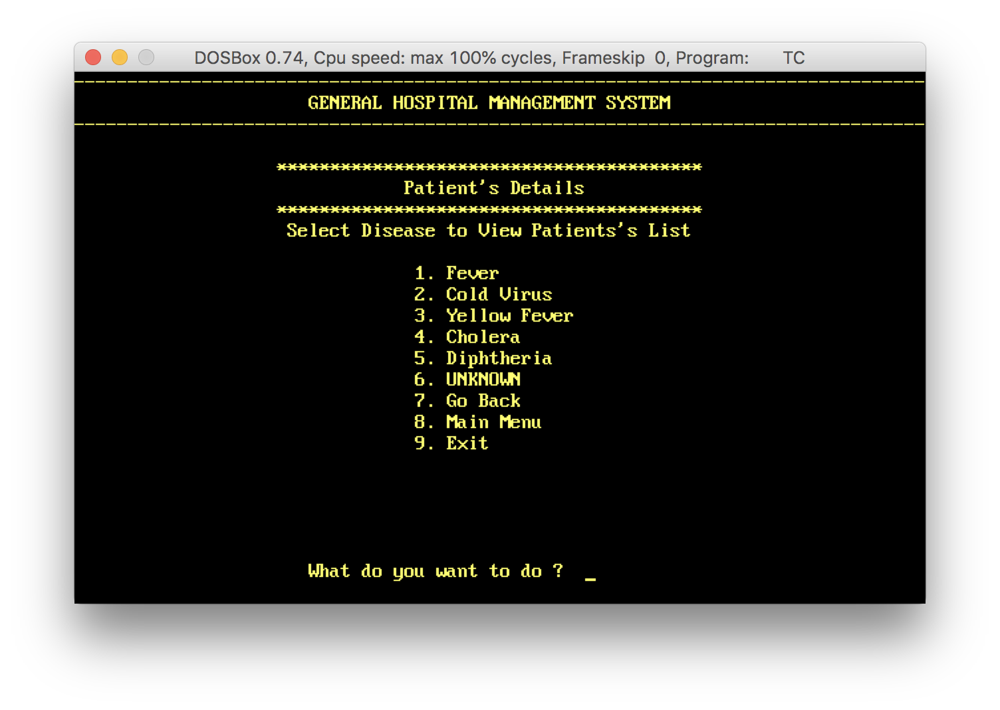
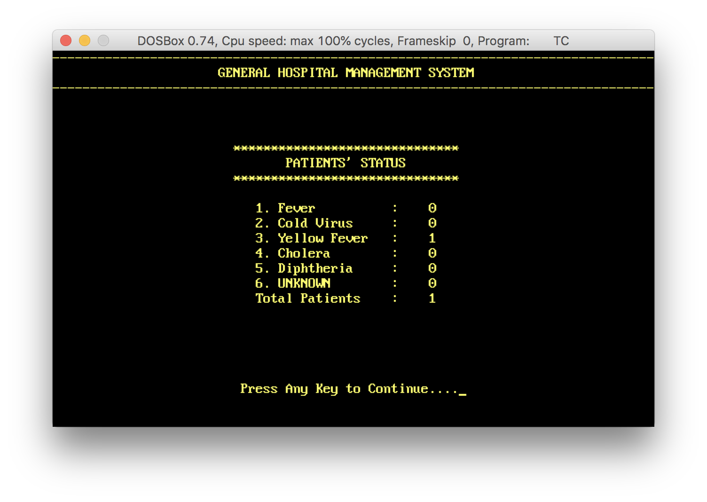
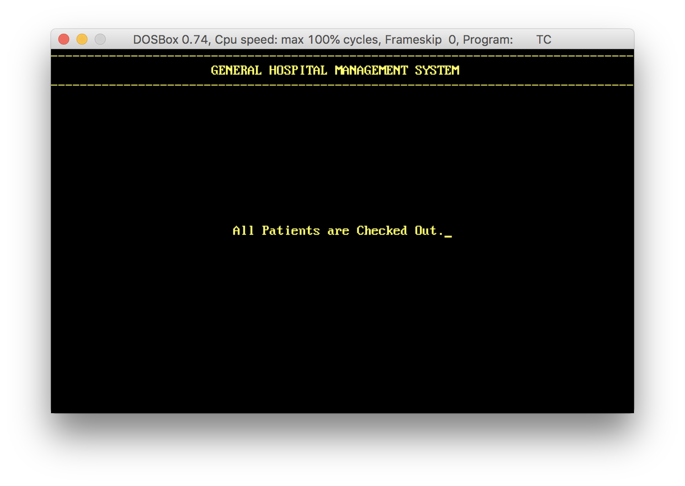
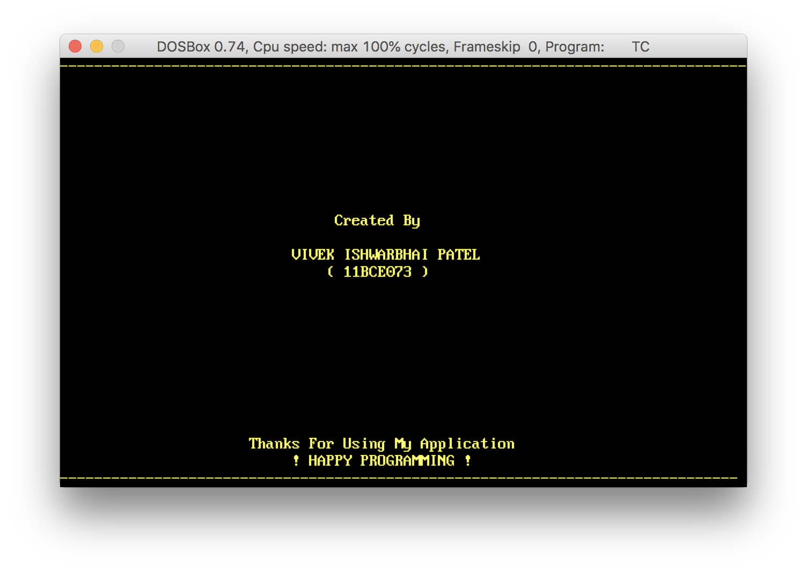
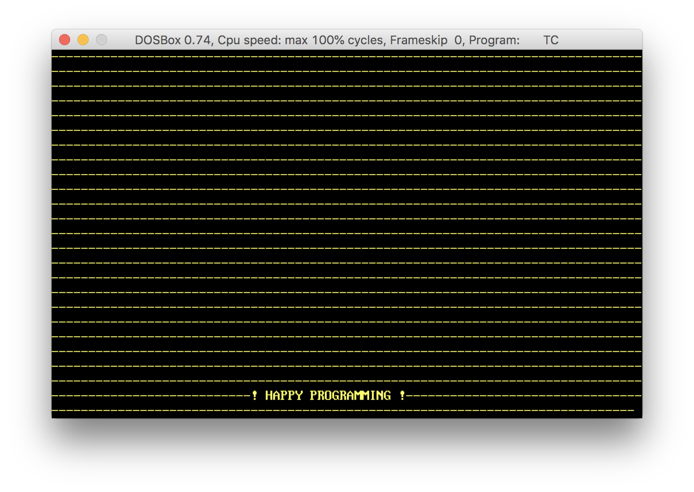

# :hospital: Hospital Management System (HMS) :ambulance:

Hospital Management System is part of [HIS(Hospital information system)](https://en.wikipedia.org/wiki/Hospital_information_system). It can create patient's list based on pre-added diseases list, list patient's based on diseases and can check-out patient(s). All data is stored in local file.

*This program is tested using Borland C++ Compiler.*

## Instructions

> PLEASE READ THIS CAREFULLY BEFORE USING PROGRAM.

@@@ OPEN "MAIN.CPP" TO RUN APPLICATION @@@

1. Password : `vivek`
    > Note that if you enter wrong password three times, application will automatically closed.

2. Copy all the .CPP files into one directory.
    > If you copy in other than c:\tc\bin directory then you will have to change the directory in Compiler.

    INFORMATION
    
    To change the directory in compiler, go to FILE > Change Directory > ( select source directory ) > OK

3. FOR ONLY FIRST TIME USE.

    You have to create files to store data.

    INFORMATION

    To create files, open app and go to main menu screen then go to : Check out patients > All patients > Exit

    CAUTION

    File creation process must be done in their first use. If you do this again your data will be lost.

4. Emergency Exit

    For every Exit, you will be prompted the message of creator. To avoid this, just go to main screen and enter " 13 " without any fail.

    INFORMATION
   
    If you add other than choice number, it will be prompt error message (because of input error), and then you can't take emergency exit from that point.

## Screenshots
### Application
> Sign In Screen

### Menus
> Main Menu

> Patients Details Menu

> Checkout Patients Menu

### Activities
> Add Patients Data

> Patients List by disease

> Patients' List

> Patients' Status

> Checkout Patients

> Credits Page

#### And btw I love programming :point_down: :heart_eyes: :computer:
