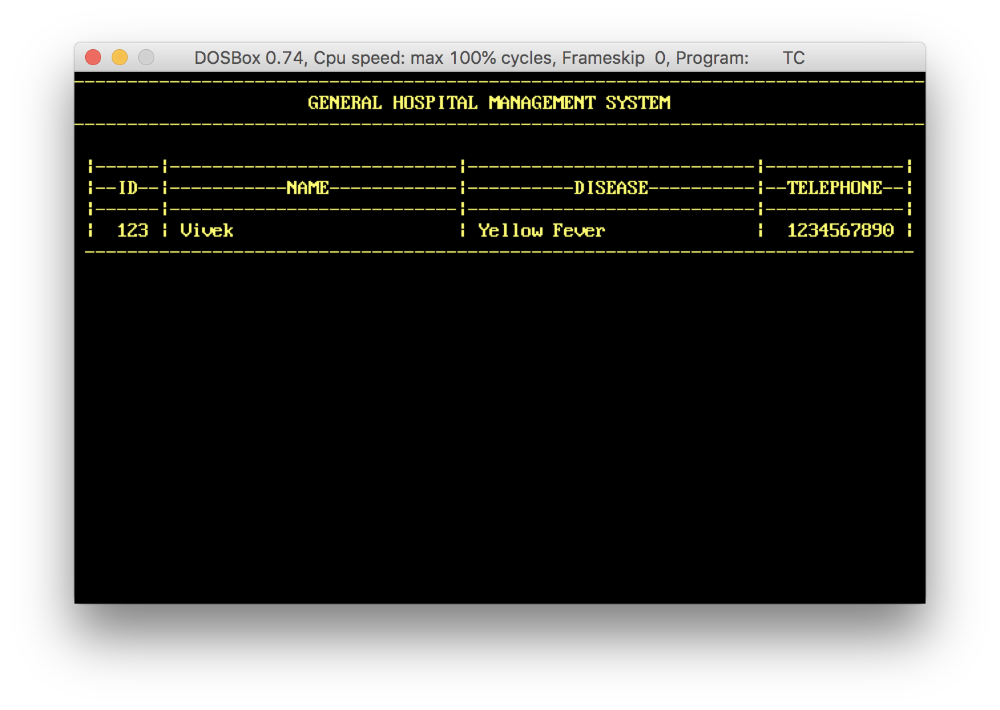

# :hospital: Hospital Management System (HMS) :ambulance:

Hospital Management System is part of [HIS(Hospital information system)](https://en.wikipedia.org/wiki/Hospital_information_system). It can create patient's list based on pre-added diseases list, list patient's based on diseases and can check-out patient(s). All data is stored in local file.

*This program is tested using Borland C++ Compiler.*

Instructions for HMS is given [here](docs/instructions.md).

## Screenshots
### Application
> Sign In Screen

### Menus
> Main Menu

> Patients Details Menu

> Checkout Patients Menu

### Activities
> Add Patients Data

> Patients List by disease

> Patients' List

> Patients' Status

> Checkout Patients

> Credits Page

#### And btw I love programming :point_down: :heart_eyes: :computer:
